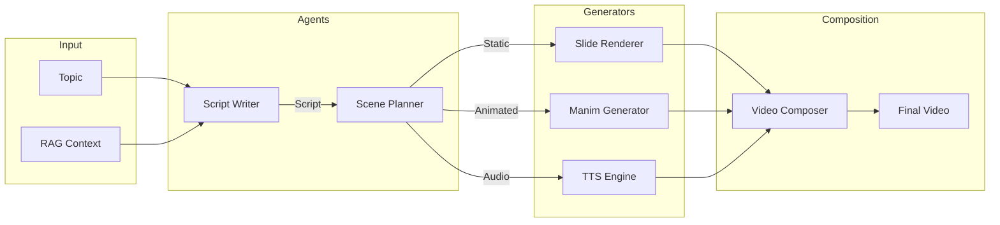
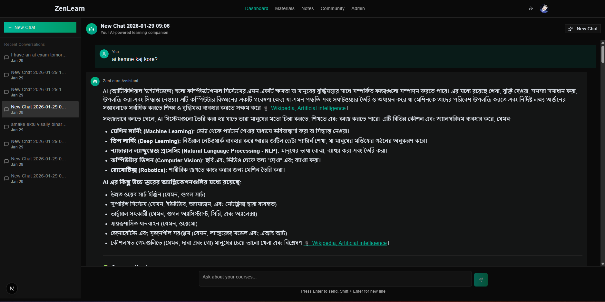
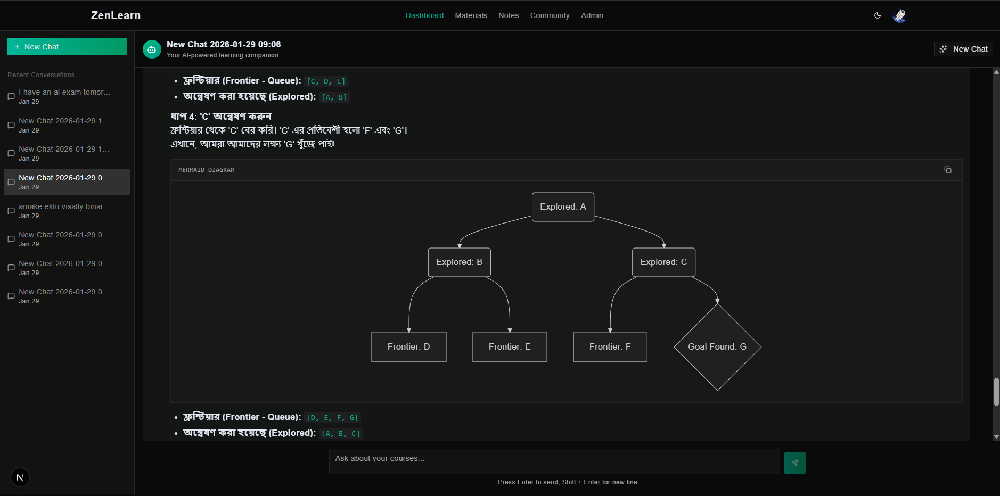
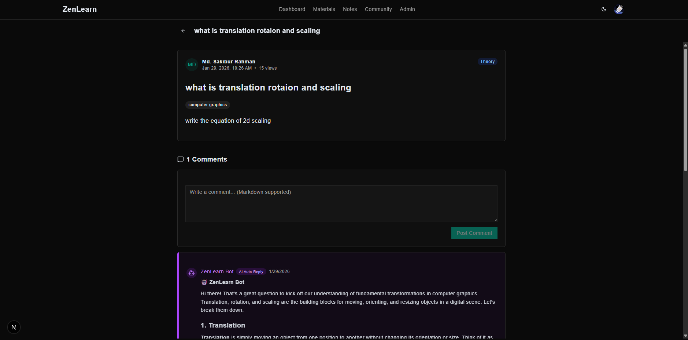
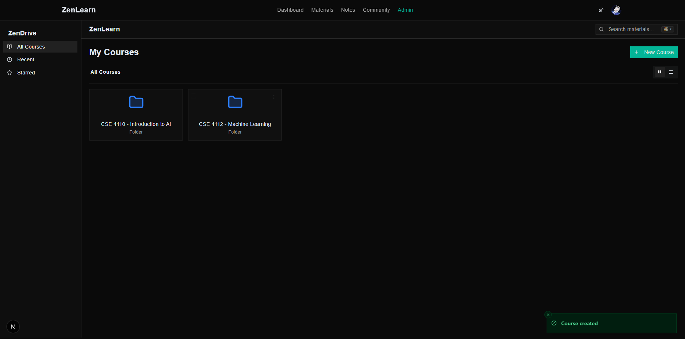
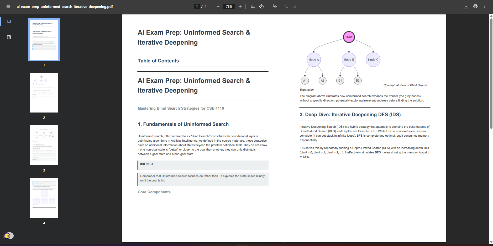
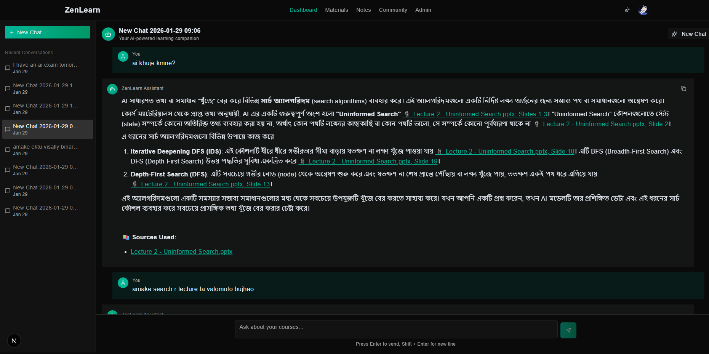

# ZenLearn - AI-Powered Supplementary Learning Platform

## BUET CSE Fest Hackathon 2026 - AI & API

## Team `ZenBit`

### Members
- [Md. Faysal Mahmud](https://github.com/faysal-star)
- [Raufun Ahsan](https://github.com/taut0logy)
- [Md. Sakibur Rahman](https://github.com/sakiburrahman07)

---

## 1. Executive Summary

### Problem Statement
University courses often rely on fragmented learning resources—slides, PDFs, and scattered code files—making it difficult for students to search for specific concepts, revise effectively, or generate structured learning materials that align with their curriculum.

### Solution
**ZenLearn** is an AI-powered supplementary learning platform designed to unify disjointed course materials into an intelligent, interactive knowledge base. It leverages a sophisticated **Hybrid RAG (Retrieval-Augmented Generation)** engine to enable semantic search and uses a multi-agent **Content Generation Pipeline** to autonomously create validated theory notes, coding labs, and educational videos from uploaded lecture materials.

---

## 2. Key Innovations & Technical Architecture

### 2.1. Hybrid RAG Engine (Retrieval-Augmented Generation)
Unlike standard vector search, ZenLearn implements a production-grade **Hybrid RAG** system to ensure high-precision retrieval across diverse academic formats.

-   **Multi-Stage Retrieval**: Combines **Dense Retrieval** (Semantic Search via Gemini Embeddings) with **Sparse Retrieval** (Keyword Matching via BM25) to capture both conceptual relevance and exact terminology.
-   **Cross-Encoder Reranking**: Utilizes the **Cohere Rerank API** to re-score retrieved documents, significantly improving context quality before LLM ingestion.
-   **Format-Specific Chunking**:
    -   **PDFs**: Semantic paragraph splitting with overlap conservation.
    -   **Slides (PPTX)**: Structure-aware extraction preserving slide boundaries and speaker notes.
    -   **Code**: AST-based chunking to respect function and class scope.

### 2.2. Autonomous Content Generation Pipeline
The platform employs a multi-agent workflow to generate academic content, ensuring structural integrity and factual correctness.

1.  **Planner Agent**: Analyzes the syllabus to create a hierarchical content outline.
2.  **Drafting Agents**:
    -   **Theory Writer**: Synthesizes explanatory text grounded in retrieved course materials.
    -   **Code Writer**: Generates programming lab exercises and solution code.
3.  **Validation Layer (Sandbox)**:
    -   **Syntax Check**: AST parsing validates generated code correctness.
    -   **Execution Sandbox**: Runs generated code against unit tests in an isolated environment to ensure functional viability.

### 2.3. Multi-Modal Video Synthesis
ZenLearn automates the creation of educational videos using a "Code-to-Video" pipeline:
-   **Scripting**: LLM generates narration scripts synchronized with visual cues.
-   **Visuals**: Orchestrates **Manim** (Mathematical Animation Engine) for algorithmic visualizations and **Pillow** for static slides.
-   **Audio**: **Edge-TTS** provides neural voice synthesis.
-   **Composition**: **FFmpeg** assembles all assets into a final MP4 lecture.

### 2.4. Intelligent Notes Digitization
The **Notes Agent** utilizes **Gemini Vision Pro** to digitize handwritten class notes. It goes beyond simple OCR by:
-   Identifying logical blocks (formulas, diagrams, text).
-   Merging content from multiple page images into a single coherent document.
-   Converting mathematical expressions into cleanly formatted **LaTeX**.

---

## 3. System Architecture

The system is built on a microservices-inspired architecture managed by a central FastAPI backend.

### High-Level Architecture
```mermaid
graph TB
    subgraph API["FastAPI Backend"]
        direction TB
        A[API Endpoints]
    end
    
    subgraph Services["Core Services"]
        S1[Gemini 1.5 Pro]
        S2[Embeddings]
        S3[Vector Store (Chroma)]
        S4[Image Gen]
    end
    
    subgraph RAG["RAG Engine"]
        R1[Chunker Strategy]
        R2[Hybrid Retrieval]
        R3[Reranker]
        R4[Context Assembler]
    end
    
    subgraph Content["Content Gen Engine"]
        C1[Theory Agent]
        C2[Lab Agent]
        C3[Validation Sandbox]
        C4[Video Pipeline]
    end
    
    A --> Services
    A --> RAG
    A --> Content
    RAG --> Services
    Content --> Services
    Content --> RAG
```

### Video Generation Pipeline


---

## 4. Module Breakdown

| Module | Directory | Responsibilities |
| :--- | :--- | :--- |
| **CMS Agent** | `agents/cms_agent/` | Course CRUD, Material Upload, RAG Indexing Triggers. |
| **RAG Engine** | `agents/rag_engine/` | Document Chunking, Embedding, Vector Search, Reranking. |
| **Content Engine** | `agents/content_gen_engine/` | Syllabus Planning, Theory/Lab Generation, Code Validation. |
| **Chat Agent** | `agents/chat-agent/` | Context-aware generic chat, Tool Use (Search, Explain). |
| **Notes Agent** | `agents/notes_agent/` | Vision-based handwriting digitization to LaTeX. |
| **Community Agent** | `agents/community_agent/` | Q&A Forum, AI Auto-Reply Bot for unanswered queries. |
| **Video Engine** | `content_gen_engine/video_gen/` | Manim script generation and video rendering. |

---

## 5. Technology Stack

### Backend & AI
-   **Framework**: FastAPI (Python)
-   **LLM Orchestration**: LangChain, Google GenAI SDK (Gemini 1.5 Pro)
-   **Vector Database**: ChromaDB (Local), PGVector (Production)
-   **Search**: Hybrid (BM25 + Chroma), Cohere Rerank
-   **Database**: PostgreSQL (Supabase), SQLAlchemy (Async), Pydantic
-   **Video**: Manim CE, FFmpeg, Edge-TTS

### Frontend
-   **Framework**: Next.js 14 (App Router)
-   **Language**: TypeScript
-   **Styling**: Tailwind CSS, Shadcn UI
-   **State/Data**: React Query, Zustand

---

## 6. Getting Started

### Prerequisites
-   Python 3.10+
-   Node.js 18+
-   PostgreSQL Database (Supabase recommended)
-   FFmpeg (for video generation)

### Backend Setup
1.  Navigate to the agents directory:
    ```bash
    cd agents
    ```
2.  Create and activate a virtual environment:
    ```bash
    python -m venv .venv
    .\.venv\Scripts\Activate  # Windows
    # source .venv/bin/activate # Linux/Mac
    ```
3.  Install dependencies:
    ```bash
    pip install -r requirements.txt
    ```
4.  Configure environment variables:
    -   Copy `.env.example` to `.env`
    -   Add API Keys: `GOOGLE_API_KEY` (Gemini), `COHERE_API_KEY` (Rerank), `SUPABASE_URL`, `DB_URL`.
5.  Run the server:
    ```bash
    uvicorn main:app --reload
    ```

### Frontend Setup
1.  Navigate to the client directory:
    ```bash
    cd client
    ```
2.  Install dependencies:
    ```bash
    npm install
    ```
3.  Configure environment variables in `.env.local`.
4.  Run the development server:
    ```bash
    npm run dev
    ```

---

## 7. Visual Reference

### Interface Screenshots







### Sample Output: Generated Video
<video width="100%" controls>
  <source src="screenshots/QuickSort_The_Art_of_Divide_and_Conquer.mp4" type="video/mp4">
  Your browser does not support the video tag.
</video>
