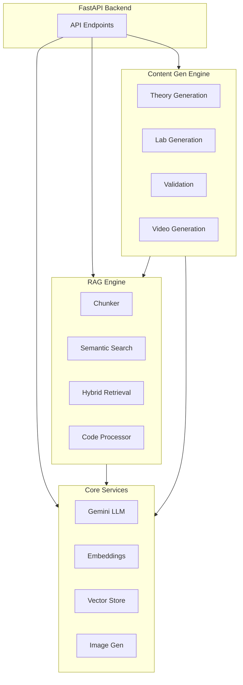
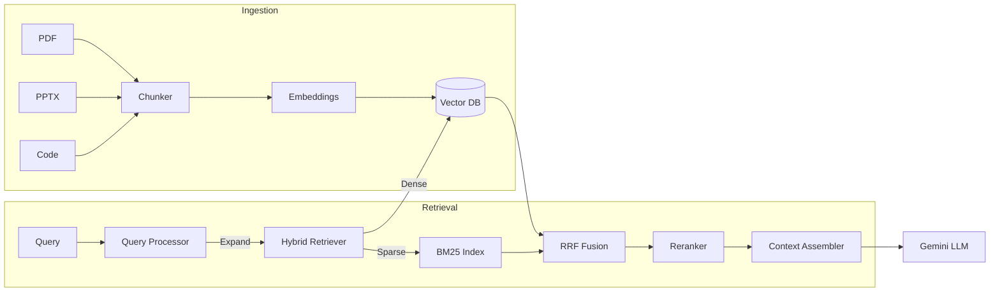
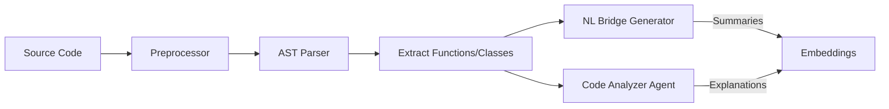
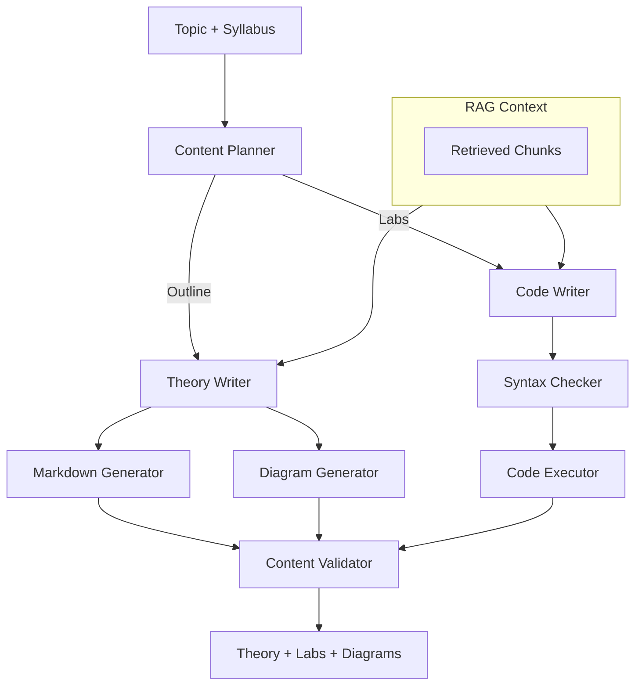
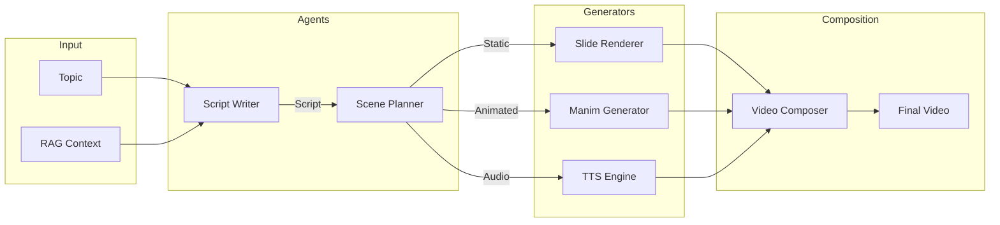
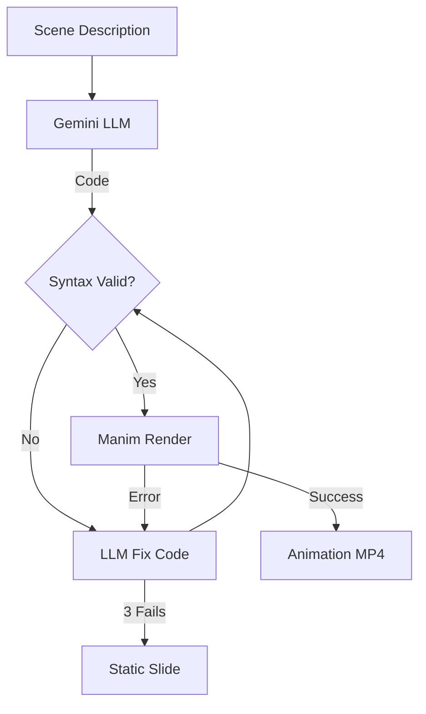

# ZenLearn - AI-Powered Learning Platform

> **BCF Hackathon 2026** - Intelligent course content generation and personalized learning

## System Architecture



---

## Core Services (`services/`)

### Gemini Service
- **Model**: `gemini-3-pro-preview` via `google-genai` SDK
- **Features**: Text generation, JSON mode, streaming, structured output with JSON schema enforcement
- **Config**: Temperature, top-p/k, max tokens, system instructions

### Embedding Service
- **Model**: Gemini text embeddings
- **Purpose**: Convert text chunks to dense vectors for semantic search
- **Batching**: Efficient batch embedding with rate limiting

### Vector Store Service
- **Backend**: ChromaDB (local) / PGVector (production)
- **Operations**: Upsert, similarity search, filtered queries, metadata handling
- **Collections**: Separate collections per course/content type

### Image Generation Service
- **Model**: Imagen 4.0 via Gemini API
- **Use Case**: Generate diagrams, illustrations, concept visualizations
- **Fallback**: Mermaid diagrams for flowcharts

---

## RAG Engine (`rag_engine/`)

### RAG Pipeline Flow



### Chunking Module (`chunker/`)

| Chunker | Source | Technique |
|---------|--------|-----------|
| **PDFChunker** | PDF documents | PyMuPDF extraction, semantic paragraph splitting, overlap windows |
| **SlideChunker** | PPTX files | python-pptx, slide-aware boundaries, speaker notes extraction |
| **CodeChunker** | Source code | AST-based splitting at function/class boundaries, docstring preservation |

**Base Chunker Features**:
- Configurable chunk size (tokens/chars)
- Overlap for context continuity
- Metadata enrichment (source, page, section)
- tiktoken for accurate token counting

### Code Processor (`code_processor/`)



| Component | Purpose |
|-----------|---------|
| **CodePreprocessor** | Clean, normalize, extract structure from source files |
| **CodeAnalyzerAgent** | LLM-powered code explanation, complexity analysis |
| **NLBridgeGenerator** | Generate natural language descriptions for code search |

### Retrieval Pipeline (`retriever/`)

| Component | Technique |
|-----------|-----------|
| **QueryProcessor** | Query expansion, intent classification, keyword extraction |
| **HybridRetriever** | Combines dense (semantic) + sparse (BM25) retrieval |
| **Reranker** | Cross-encoder reranking using Cohere Rerank API |
| **ContextAssembler** | Dedupe, order, format retrieved chunks for LLM context |

---

## Content Generation Engine (`content_gen_engine/`)

### Content Generation Flow



### Agents (`agents/`)

| Agent | Role |
|-------|------|
| **ContentPlanner** | Create course outlines, learning objectives, module structure |
| **TheoryWriter** | Generate explanatory content with examples, analogies |
| **CodeWriter** | Generate executable code with comments, test cases |

### Validators (`validators/`)

| Validator | Purpose |
|-----------|---------|
| **SyntaxChecker** | AST validation for generated code (Python/JS/Java) |
| **CodeExecutor** | Sandbox execution, test runner, output verification |
| **ContentValidator** | Factual accuracy check via LLM grounding |

---

## Video Generation (`video_gen/`)

### Video Pipeline Architecture



### Manim Generation with Fix Loop



### Components

| Component | Technology | Purpose |
|-----------|------------|---------|
| **ScriptWriter** | Gemini structured output | Generate engaging narration scripts |
| **ScenePlanner** | Gemini + heuristics | Plan visual scenes (static/animated/code) |
| **SlideRenderer** | Pillow | Generate 1080p slide images |
| **ManimGenerator** | Manim CE + LLM | Mathematical/algorithmic animations |
| **TTSEngine** | Edge-TTS | Neural text-to-speech synthesis |
| **VideoComposer** | FFmpeg | Assemble slides, audio, animations |

---

## Tech Stack

| Category | Technologies |
|----------|-------------|
| **LLM** | Gemini 3 Pro, Cohere Rerank |
| **Embeddings** | Gemini Embeddings |
| **Vector DB** | ChromaDB, PGVector |
| **Document Processing** | PyMuPDF, python-pptx, tiktoken |
| **Video** | Manim CE, Edge-TTS, FFmpeg, Pillow |
| **API** | FastAPI, Pydantic, asyncio |
| **Code Analysis** | Python AST, tree-sitter |

---

## Quick Start

```bash
cd agents
python -m venv .venv
.\.venv\Scripts\Activate.ps1  # Windows
pip install -r requirements.txt

# Set environment
cp .env.example .env
# Add GOOGLE_API_KEY, COHERE_API_KEY

# Run
uvicorn main:app --reload
```

## Testing

```bash
python -m pytest tests/ -v
python -m tests.test_video_gen  # Video pipeline
```
