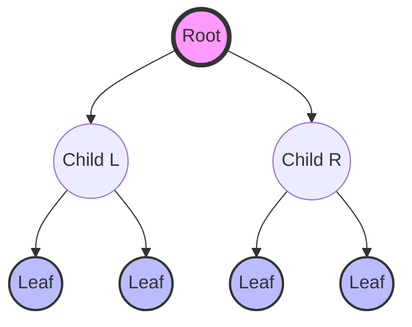
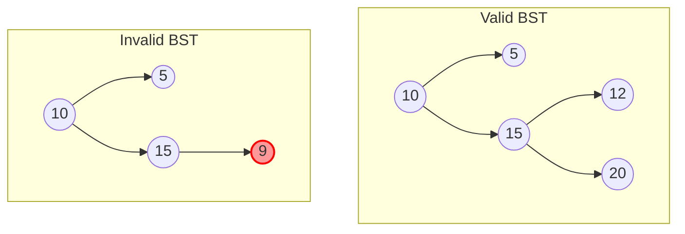

# Data Structures 101: Anatomy & Logic of Binary Trees

## Table of Contents

---

# Data Structures 101: Anatomy & Logic of Binary Trees
### Understanding Hierarchical Data, Recursion, and The Binary Search Property


---


## 1. Introduction to Binary Trees

Unlike arrays or linked lists, which are linear data structures, trees are hierarchical. A  is a specific type of tree where each node has at most two children, typically referred to as the  and the .

To understand trees, we must define their anatomy:

We measure the scale of trees using  (distance from root to a specific node) and  (longest path from the root to a leaf).

> 💡 **TIP**
> 
> 
 Think of your computer's File System. The "Root" directory contains folders (subtrees) and files (leaves). The HTML Document Object Model (DOM) is also a tree structure.





---


## 2. Implementing the Node Structure

A tree is not a single contiguous block of memory like an array. It is a collection of objects (Nodes) linked together by references (pointers). The fundamental building block is the .

Every node must contain three specific components:

**Python TreeNode Class**
```python

class TreeNode:
    def __init__(self, val=0, left=None, right=None):
        self.val = val
        self.left = left    # Reference to left child
        self.right = right  # Reference to right child

# Example Usage:
# Creating the root
root = TreeNode(10)

# Adding children
root.left = TreeNode(5)
root.right = TreeNode(15)

# Structure created:
#      10
#     /  \
#    5    15

```

> ℹ️ **INFO**
> 
> 
In memory, these nodes may be scattered. The  and  attributes act as the address map that holds the structure together.


---


## 3. Tree Traversals (DFS)

Because trees are non-linear, there is no single "correct" way to iterate through them. We use  traversals to visit nodes. The order in which we process the "Root" (current node) relative to its children determines the traversal type.


**Recursive In-order Traversal**
```python

def inorder_traversal(node):
    # Base Case: If the node is None, stop recursion
    if node is None:
        return

    # 1. Traverse Left Subtree
    inorder_traversal(node.left)
    
    # 2. Process Current Node (Root)
    print(node.val)
    
    # 3. Traverse Right Subtree
    inorder_traversal(node.right)

```


---


## 4. The Binary Search Tree (BST) Property

A Binary Search Tree (BST) is a special kind of binary tree that enforces a strict logic, known as the :

> ⚠️ **WARNING**
> 
> 
 For any given node, all values in its  must be smaller than the node, and all values in its  must be larger.


This property turns the tree into a powerful search tool. Instead of checking every element (like in an unsorted array), we can eliminate half the tree at every step. If we are looking for the number 50, and the current node is 100, we know with certainty that 50 must be to the left, and we can ignore the entire right side.





---


## 5. Algorithmic Complexity Analysis

The efficiency of a Binary Tree depends heavily on its shape (topology).


### Key Takeaways


---
