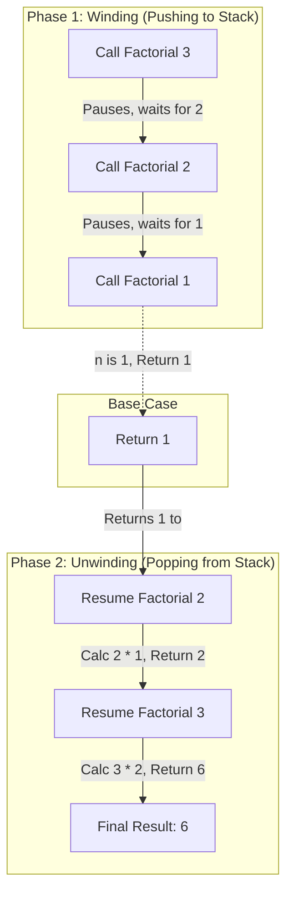
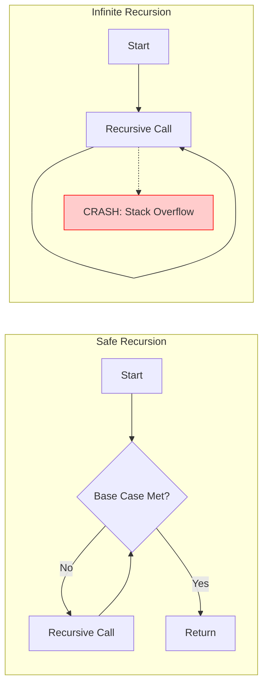

# Introduction to Recursion: Thinking Recursively

## Table of Contents

---

# Introduction to Recursion
### Thinking Recursively: From Matryoshka Dolls to Algorithms


---


## The Recursive Leap of Faith

Recursion is a method of solving a computational problem where the solution depends on solutions to smaller instances of the same problem. Simply put, it is a function that calls itself.

### The Two Pillars of Recursion

To write a recursive function without crashing your program, you need two essential components:

- 
- 

<!-- IMAGE: A high-quality illustration of Russian Matryoshka dolls arranged in a line on a wooden table. The largest doll on the left is labeled 'Outer Call', the middle dolls are labeled 'Inner Calls', and the smallest solid doll on the far right is labeled 'Base Case'. Soft, educational lighting. -->
*[Image: Russian nesting dolls illustrating the concept of recursion reducing a problem size until a base case is reached.]*

### Analogy: The Matryoshka Doll

Imagine opening a Russian nesting doll. You open the first one to find a smaller one inside. You repeat this process (the recursive step) until you reach the tiniest, solid doll that cannot be opened (the base case). Recursion is not magic; it is simply deferred execution where a task is paused to handle a sub-task.

### Code Example: The Countdown

Let's compare how we count down from a number using a standard loop versus a recursive approach.

**Iterative vs. Recursive Countdown**
```python

# 1. Iterative Approach (The Loop)
def countdown_iterative(n):
    while n > 0:
        print(n)
        n -= 1
    print("Blastoff!")

# 2. Recursive Approach (The Self-Call)
def countdown_recursive(n):
    # Base Case: When to stop
    if n <= 0:
        print("Blastoff!")
        return
    
    # Recursive Step: Do work, then call self with smaller input
    print(n)
    countdown_recursive(n - 1)

```

> 💡 **TIP**
> 
> 
Notice in the recursive version, there is no `while` or `for` loop. The repetition happens because the function calls itself again.


---


## Under the Hood: The Call Stack

To understand how recursion works in computer memory, we must understand the . Every time a function is called, the computer creates a "Stack Frame" in memory to store that function's variables and execution point.

### Winding and Unwinding

Recursion happens in two phases:

- 
- 

### Tracing Factorial(3)

Let's visualize calculating the factorial of 3 (`3! = 3 * 2 * 1`).



**Tracing the Factorial Stack**
```python

def factorial(n):
    # Base Case
    if n == 1:
        return 1
    
    # Recursive Step
    # The function pauses here to wait for the result of factorial(n-1)
    result = n * factorial(n - 1)
    return result

# Execution of factorial(3):
# 1. factorial(3) calls factorial(2) -> waits
# 2. factorial(2) calls factorial(1) -> waits
# 3. factorial(1) returns 1
# 4. factorial(2) resumes: 2 * 1 = returns 2
# 5. factorial(3) resumes: 3 * 2 = returns 6

```


---


## Pitfalls, Complexity, and Practice

### The Danger: Stack Overflow

If you forget the base case, or if your recursive step doesn't move toward the base case, the function will call itself indefinitely. Since the Call Stack has a limited size, the program will eventually crash with a  error.

> ⚠️ **WARNING**
> 
> 
 Recursive solutions are often more elegant and easier to read (especially for tree structures), but they consume more memory (Space Complexity) because every active call takes up space on the stack. Iterative loops usually have O(1) space complexity.




### When to use Recursion?

Recursion shines in "Divide and Conquer" algorithms (like Merge Sort) and when navigating hierarchical data structures like File Systems or DOM Trees.

### Coding Challenge

Try to solve the following problem using recursion. Do not use a loop!

**Exercise: Sum of Array**
```python

# Challenge: Complete this function
def sum_array(arr):
    """
    Recursively calculate the sum of a list of integers.
    Example: sum_array([1, 2, 3]) should return 6.
    """
    # 1. Identify the Base Case (What is the sum of an empty list?)
    
    # 2. Identify the Recursive Step (Current number + sum of the rest)
    pass

```


---


## Key Takeaways

- 
- 
- 
- 


---
