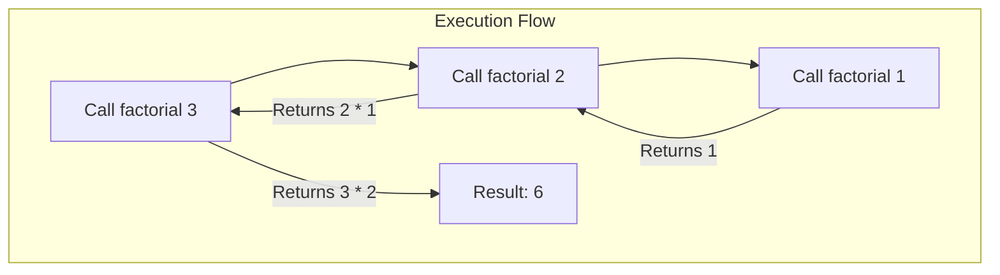

# Introduction to Recursion

## Table of Contents

---

# Introduction to Recursion
### Mastering the Art of Self-Reference in Programming


---


## What is Recursion?

Imagine a set of Russian nesting dolls (Matryoshka dolls). To find the smallest doll hidden inside, you must open the biggest doll, then the next biggest, and so on, until you reach the tiny solid doll at the center that cannot be opened further.

<!-- IMAGE: A minimalist vector illustration of Russian nesting dolls (Matryoshka) being opened one by one, arranged in a line from largest to smallest, demonstrating the concept of self-similarity. -->
*[Image: Illustration of Russian nesting dolls arranged by size]*

In computer science,  is a programming technique where a function calls itself to solve a problem. It breaks a large, complex problem down into smaller, identical versions of the same problem.

### The Two Golden Rules

For a recursive function to work correctly and not run forever, it must have two specific parts:

- 
- 


---


## How Recursion Works: The Call Stack

To understand recursion, you must understand the . When a function calls another function (or itself), the computer pauses the current function and pushes it onto a "stack" in memory. It only finishes the paused function once the called function returns a result.



> ⚠️ **WARNING**
> 
> 
 If you forget your Base Case, the function will keep adding layers to the stack until the computer runs out of memory. This is known as a "Stack Overflow" error.


Let's look at a classic example: calculating the Factorial of a number ($n!$).

**Factorial Implementation**
```python

def factorial(n):
    # 1. The Base Case
    if n == 1:
        return 1
    
    # 2. The Recursive Case
    else:
        return n * factorial(n - 1)

# Usage
print(factorial(5)) # Output: 120

```


---


## Visualizing the Process

Let's trace exactly what happens when we run `factorial(3)`. The computer does not calculate the answer immediately; it builds a chain of requests.

- 
- 
- 
- 
- 

### Another Example: Countdown

Recursion isn't just for math. It can be used for tasks like counting down or traversing file directories.

**Countdown Function**
```python

def countdown(n):
    print(n)
    # Base Case: Stop at 0
    if n == 0:
        print("Blastoff!")
    # Recursive Case: Call with n-1
    else:
        countdown(n - 1)

countdown(3)

```

> 💡 **TIP**
> 
> 
 Anything you can do with recursion, you can also do with a loop (iteration). Recursion is often preferred when the problem involves hierarchical structures (like trees or file systems) because the code is cleaner and easier to read.


---


## Key Takeaways

Recursion is a powerful tool in a programmer's toolkit. Here is what you should remember:

- 
- 
- 
- 

Start practicing by rewriting simple `for` loops as recursive functions to build your intuition!


---
