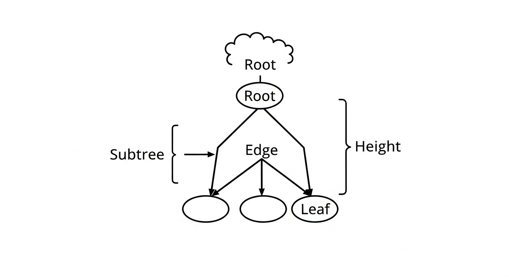
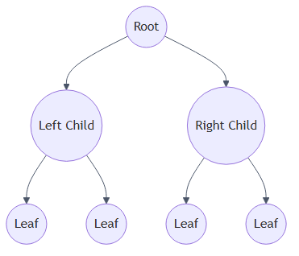
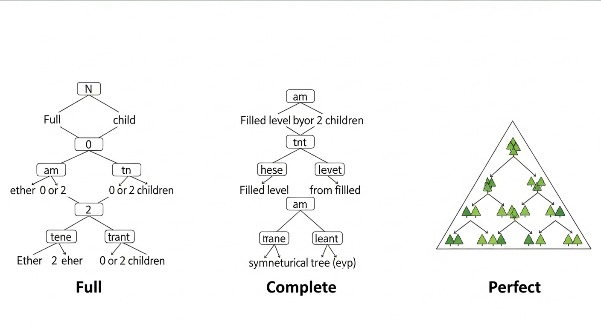
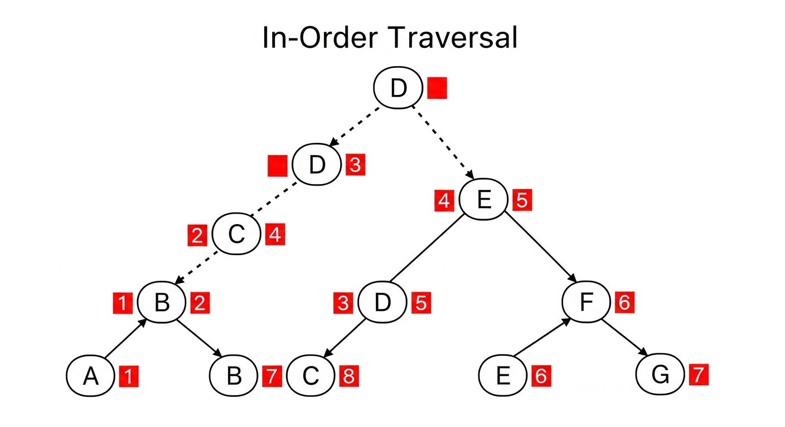
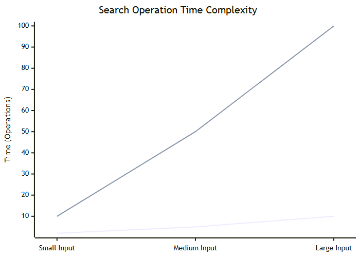

# Mastering Binary Trees: Structure & Algorithms

## Table of Contents

---

# Mastering Binary Trees: Structure & Algorithms
### A Comprehensive Guide to Hierarchical Data Structures


---


## 1. The Anatomy of a Binary Tree

A binary tree is a fundamental hierarchical data structure used in computer science. Unlike linear data structures like arrays or linked lists, trees organize data hierarchically. In a binary tree, every node has at most two children, typically referred to as the "left child" and the "right child."



### Core Terminology

To manipulate trees effectively, you must understand the vocabulary used to describe their structure:

> ℹ️ **INFO**
> 
> 
 A binary tree is recursive by definition. Every child node is effectively the "root" of its own smaller binary tree (a subtree). This property is why recursion is the primary method for traversing trees.



*Visualizing Parent-Child Relationships*


---


## 2. Taxonomy: Types of Binary Trees

Not all binary trees are created equal. The shape of the tree heavily influences the efficiency of operations like searching and inserting. Recognizing these types helps in analyzing algorithm complexity.



### Structural Classifications

> ⚠️ **WARNING**
> 
> 
 In a Perfect or Complete tree, the height is logarithmic (log n), ensuring fast operations. In a Degenerate tree, the height is linear (n), causing operations to slow down significantly.


---


## 3. Implementation Strategy

In memory, a binary tree is typically implemented using linked nodes. Each node is an object that contains data and references (pointers) to its children.

### The Node Class

Below is the standard implementation of a Tree Node in Python. It serves as the building block for the entire structure.

**Python TreeNode Implementation**
```python

class TreeNode:
    def __init__(self, val=0):
        # The data stored in the node
        self.val = val
        
        # Reference to the left child (default is None)
        self.left = None
        
        # Reference to the right child (default is None)
        self.right = None

# Example usage:
# Creating a root node with value 1
root = TreeNode(1)
# Adding children
root.left = TreeNode(2)
root.right = TreeNode(3)

```

### Implementation Details


---


## 4. Traversal Algorithms (DFS & BFS)

Traversal refers to the process of visiting every node in the tree exactly once. Because trees are non-linear, there is no single "correct" way to iterate through them.

### Depth-First Search (DFS)

DFS algorithms explore as deep as possible along each branch before backtracking. There are three main variations:



**Recursive In-Order Traversal**
```python

def inorder_traversal(root):
    # Base case: if the node is None, stop recursion
    if root is None:
        return

    # 1. Traverse the left subtree
    inorder_traversal(root.left)
    
    # 2. Visit the root (process data)
    print(root.val)
    
    # 3. Traverse the right subtree
    inorder_traversal(root.right)

```

### Breadth-First Search (BFS)

Also known as Level-Order Traversal, BFS visits all nodes at depth 0, then depth 1, then depth 2, and so on. It typically uses a Queue data structure rather than recursion.


---


## 5. Complexity Analysis & Key Takeaways

Understanding the efficiency of tree operations is crucial for system design. The complexity usually depends on the height of the tree ($h$).


*Time Complexity: Balanced vs Skewed*

### Key Takeaways


---
